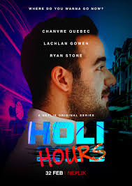

# MovieFlix - Demo Streaming Platform

This is a **demo project** created for educational purposes only. It's inspired by Netflix's design but is not affiliated with Netflix in any way.

## Features
- Responsive design
- Movie grid layout
- Interactive hover effects
- Modern UI/UX

## Technologies Used
- HTML5
- CSS3
- JavaScript

## Demo
This is a student project demonstrating front-end web development skills.

**Disclaimer:** This project is for educational purposes only and is not intended for commercial use.

# NetFlix_Clone
## Date: 10/07/2025
## Objective:
To create a modern, responsive navigation bar using CSS Flexbox, mimicking real-world websites like Netflix. This helps reinforce alignment, spacing, and layout structuring using Flexbox properties.

## Tasks:

#### 1. Structure the HTML Layout:
Use a ```<nav>``` tag as the main container.

Add a brand logo/title on the left using a ```<div> or <h1>```.

Add navigation links like Home, Menu, About, Contact, and Login using a ```<ul> with <li> and <a>```.

#### 2. Apply Flexbox for Layout:
Use display: flex on the ```<nav>``` container.

Use justify-content: space-between to align the logo and menu.

Use align-items: center to vertically center both sections.

Style list items with horizontal spacing using gap or margin.

#### 3. Style Like a Real-World Navbar:
Add background color (e.g., dark or gradient like Netflix/Zomato).

Style text with bold fonts, hover effects, and link styling.

Remove default ul and li styles (list-style: none, text-decoration: none).

#### 4. Bonus Enhancements:
Add a hover underline or button effect on links.

Make it responsive using flex-wrap or media queries.

Fix the nav bar to top with position: sticky.
## HTML Code:
```
<!DOCTYPE html>
<html lang="en">
  <head>
    <meta charset="UTF-8" />
    <meta name="viewport" content="width=device-width, initial-scale=1.0" />
    <title>MovieFlix - Entertainment Hub</title>
    <link rel="stylesheet" href="style.css" />
  </head>
  <body>
    <section class="herosection">
      <div class="navigation-bar">
        
        <nav>
          <ul>
            <li><a href="">Home</a></li>
            <li><a href="">TV Shows</a></li>
            <li><a href="">Movies</a></li>
            <li><a href="">Recently Added</a></li>
            <li><a href="">My List</a></li>
          </ul>
        </nav>
        <div class="user-profile">
          
          
          
        </div>
      </div>

      <div class="body-content">
        <div class="rating">
            <ul class="rating-ul">
                <li>8.9</li>
                <li>2023</li>
                <li>Action Thriller</li>
            </ul>
        </div>
        <h3>PREMIUM COLLECTION</h3>
        <p>
          Experience the ultimate collection of action-packed movies and thrilling adventures. 
          From heart-stopping action sequences to mind-bending plot twists, dive into a world 
          of premium entertainment that will keep you on the edge of your seat.
        </p>
        <div class="body-btn">
          <button id="watch-btn" type="submit">▶ WATCH NOW</button>
          <button id="add-btn" type="submit">+ ADD TO LIST</button>
        </div>
      </div>
    </section>

    <section class="container2">
        <div class="categories">
            <ul>
                <li>🔥 Hot Picks</li>
                <li>⭐ Top Rated</li>
                <li>🎬 MovieFlix Exclusives</li>
                <li>🆕 New Releases</li>
                <li>📈 Trending Now</li>
            </ul>
        </div>
        <div class="sub-categories">
            <ul class="sub-categories-ul">
                <li class="odd">Action</li>
                <li class="even">Thriller</li>
                <li class="odd">Sci-Fi</li>
                <li class="even">Adventure</li>
                <li class="odd">Crime</li>
                <li class="even">Drama</li>
                <li class="odd">Mystery</li>
                <li class="even">Romance</li>
            </ul>
        </div>

        <div class="section-title">
            <h2>🎬 Featured Movies</h2>
        </div>
        <div class="movies">
            <div class="movie">
                
                <div class="movie-info">
                    <h4>Project Power</h4>
                    <p>⭐ 8.5</p>
                </div>
            </div>
            <div class="movie">
                
                <div class="movie-info">
                    <h4>Heart Of Stone</h4>
                    <p>⭐ 9.1</p>
                </div>
            </div>
            <div class="movie">
                
                <div class="movie-info">
                    <h4>Annihilation</h4>
                    <p>⭐ 8.7</p>
                </div>
            </div>
            <div class="movie">
                
                <div class="movie-info">
                    <h4>Sword of Destiny</h4>
                    <p>⭐ 8.3</p>
                </div>
            </div>
            <div class="movie">
                
                <div class="movie-info">
                    <h4>Riverdale</h4>
                    <p>⭐ 9.2</p>
                </div>
            </div>
            <div class="movie">
                
                <div class="movie-info">
                    <h4>Enola Holmes</h4>
                    <p>⭐ 8.9</p>
                </div>
            </div>
        </div>
        
        <div class="section-title">
            <h2>🎭 More Premium Content</h2>
        </div>
        <div class="movies">
            <div class="movie">
                
                <div class="movie-info">
                    <h4>1899</h4>
                    <p>⭐ 8.8</p>
                </div>
            </div>
            <div class="movie">
                
                <div class="movie-info">
                    <h4>Ileowo</h4>
                    <p>⭐ 8.2</p>
                </div>
            </div>
            <div class="movie">
                
                <div class="movie-info">
                    <h4>The Gray Man</h4>
                    <p>⭐ 9.0</p>
                </div>
            </div>
            <div class="movie">
                
                <div class="movie-info">
                    <h4>Life</h4>
                    <p>⭐ 8.6</p>
                </div>
            </div>
            <div class="movie">
                
                <div class="movie-info">
                    <h4>Holi Hours</h4>
                    <p>⭐ 8.4</p>
                </div>
            </div>
            <div class="movie">
                
                <div class="movie-info">
                    <h4>Outside the Wire</h4>
                    <p>⭐ 8.7</p>
                </div>
            </div>
        </div>
    </section>

    <footer class="footer">
        <div class="footer-content">
            <p>&copy; 2024 MovieFlix. All rights reserved. | Premium Entertainment Experience</p>
            <p style="margin-top: 10px; font-size: 12px; opacity: 0.7;">This is a demo project for educational purposes only</p>
        </div>
    </footer>
  </body>
</html>

```
## CSS Code:
```
body{
    margin: 0;
    font-family:'Segoe UI', Tahoma, Geneva, Verdana, sans-serif;
    background-color: #141414;
}

.herosection {
    background-image: linear-gradient(rgba(0,0,0,0.5), rgba(0,0,0,0.7)), url('Netflix-Background.jpg');
    background-size: cover;
    background-position: center;
    background-repeat: no-repeat;
    min-height: 100vh;
    position: relative;
    background-attachment: fixed;
}

.navigation-bar{
    display: flex;
    justify-content: space-between;
    align-items: center;
    padding: 10px;
    margin-top: 0;
    position: sticky;
    top: 0;
    left: 0;
    z-index: 10;
    background-color: rgba(41, 40, 40, 0.3); 
    backdrop-filter: blur(10px);       
    -webkit-backdrop-filter: blur(10px); 
}

#logo{
    width: 100px;
    height: 50px;
}

.icons{
    width: 20px;
    height: 20px;
}
nav{
    width: 40%;
}

li{
    color: white;
    list-style: none;
}

ul{
    display: flex;
    flex-direction: row;
    justify-content: space-around;
    padding: 0;
}

a{
    text-decoration: none;
    color: white;
    border-bottom: 3px solid transparent;
    transition: border-color 0.3s ease;
}

a:hover{
    border-bottom: 3px solid red;
    transition-duration: 0.3s;
}

.user-profile{
    display: flex;
    justify-content: space-between;
    width: 150px;
}

.body-content{
    position: relative;
    z-index: 2;
    max-width: 600px;
    padding: 20px;
    margin-top: 100px;
}

.rating-ul{
    width: 15%;
    display: flex;
    justify-content: space-between;
}

.rating-ul li{
    border-right: 2px solid red;
    padding-right: 20px;
    text-align: center;
}

.body-content h3, p{
    color: white;
}

.body-content h3{
    font-size: 48px;
    font-weight: bold;
    color: white;
    text-shadow: 2px 2px 4px rgba(0,0,0,0.8);
    margin-bottom: 20px;
    letter-spacing: 2px;
    padding: 0;
    margin: 0;
}

.body-content p{
    font-size: 18px;
    color: white;
    line-height: 1.6;
    text-shadow: 1px 1px 2px rgba(0,0,0,0.8);
    margin-bottom: 30px;
    width: 500px;
}

.body-btn{
    margin-top: 30px;
}

#watch-btn {
    background: linear-gradient(135deg, #e50914, #ff6b6b);
    border: none;
    color: white;
    padding: 15px 35px;
    font-size: 16px;
    font-weight: bold;
    border-radius: 6px;
    cursor: pointer;
    transition: all 0.3s ease;
    text-transform: uppercase;
    letter-spacing: 1px;
}

#watch-btn:hover {
    background: linear-gradient(135deg, #ff6b6b, #e50914);
    transform: translateY(-2px);
    box-shadow: 0 6px 20px rgba(229, 9, 20, 0.4);
}

#add-btn {
    background: rgba(255, 255, 255, 0.2);
    backdrop-filter: blur(10px);
    border: 2px solid rgba(255, 255, 255, 0.3);
    color: white;
    padding: 13px 33px;
    font-size: 16px;
    font-weight: bold;
    border-radius: 6px;
    cursor: pointer;
    transition: all 0.3s ease;
    margin-left: 15px;
    text-transform: uppercase;
    letter-spacing: 1px;
}

#add-btn:hover {
    background: rgba(255, 255, 255, 0.3);
    border-color: rgba(255, 255, 255, 0.5);
    transform: translateY(-2px);
}

.container2 {
    background-color: #141414;
    padding: 40px 0;
}

.categories{
    background-color: rgb(55, 55, 55);
    margin: 0;
    padding: 10px;
}

.categories ul li{
    text-decoration: none;
    color: white;
    border-bottom: 3px solid transparent;
    transition: border-color 0.3s ease;
    padding: 10px 20px;
    margin: 0 10px;
    border-radius: 25px;
}

.categories ul li:hover{
    border-bottom: 3px solid red;
    transition-duration: 0.3s;
    cursor: pointer;
    background: rgba(255, 255, 255, 0.1);
    transform: translateY(-2px);
}

.sub-categories{
    background-color: rgb(41, 40, 40);
    padding: 10px;
    display: flex;
    justify-content:center;
}

.sub-categories-ul{
    width: 80%;
    display: flex;
    justify-content: space-between;
}

.odd{
    background-color: red;
    color: white;
    padding: 5px 20px 5px 20px;
    border-radius: 20px;
}

.even{
    background-color: rgb(32, 32, 32);
    color: white;
    padding: 5px 20px 5px 20px;
    border-radius: 20px;
}

.section-title {
    margin: 40px 0 20px 0;
    padding: 0 20px;
    background-color: #141414;
}

.section-title h2 {
    color: white;
    font-size: 28px;
    font-weight: bold;
    text-shadow: 1px 1px 2px rgba(0,0,0,0.8);
    margin-bottom: 20px;
}

.movies {
    display: grid;
    grid-template-columns: repeat(6, 1fr);
    gap: 20px;
    padding: 0 20px;
    background-color: #141414;
    margin-bottom: 40px;
}

.movie {
    position: relative;
    transition: transform 0.3s ease;
    border-radius: 8px;
    overflow: hidden;
    box-shadow: 0 4px 12px rgba(0,0,0,0.5);
    cursor: pointer;
    aspect-ratio: 2/3;
}

.movie:hover {
    transform: scale(1.1);
    box-shadow: 0 8px 25px rgba(0,0,0,0.8);
    z-index: 5;
}

.movie img {
    width: 100%;
    height: 100%;
    object-fit: cover;
    display: block;
}

.movie-info {
    position: absolute;
    bottom: 0;
    left: 0;
    right: 0;
    background: linear-gradient(transparent, rgba(0,0,0,0.9));
    color: white;
    padding: 20px 15px 10px;
    transform: translateY(100%);
    transition: transform 0.3s ease;
}

.movie:hover .movie-info {
    transform: translateY(0);
}

.movie-info h4 {
    margin: 0 0 5px 0;
    font-size: 14px;
    font-weight: bold;
}

.movie-info p {
    margin: 0;
    font-size: 12px;
    opacity: 0.9;
}

.footer {
    background-color: #141414;
    color: #999;
    text-align: center;
    padding: 30px 0;
    margin-top: 50px;
    border-top: 1px solid #333;
}

.footer-content p {
    margin: 0;
    font-size: 14px;
}

@media (max-width: 1200px) {
    .movies {
        grid-template-columns: repeat(4, 1fr);
    }
}

@media (max-width: 768px) {
    .movies {
        grid-template-columns: repeat(3, 1fr);
        gap: 10px;
        padding: 0 10px;
    }
    
    .movie-info h4 {
        font-size: 12px;
    }
    
    .movie-info p {
        font-size: 10px;
    }
    
    .section-title h2 {
        font-size: 24px;
    }
}

@media (max-width: 480px) {
    .movies {
        grid-template-columns: repeat(2, 1fr);
    }
}

```
## Output:


## Result:
A modern, responsive navigation bar using CSS Flexbox, mimicking real-world websites like Netflix. This helps reinforce alignment, spacing, and layout structuring using Flexbox properties is created successfully.
